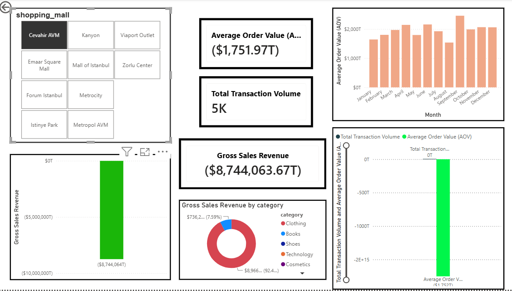
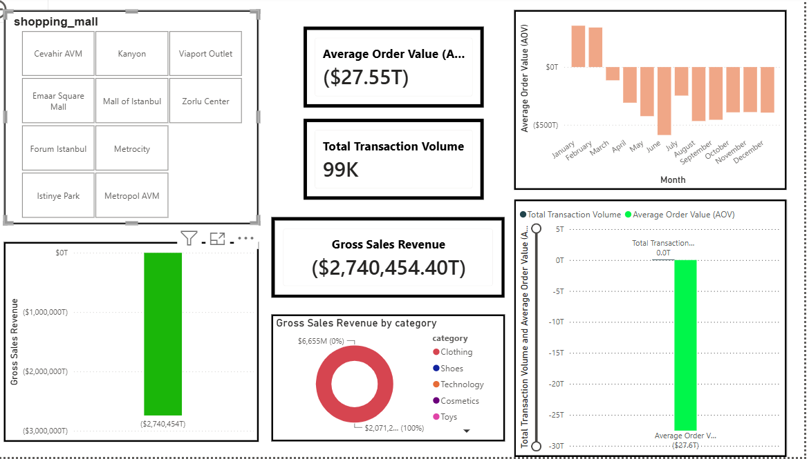

# Retail-Analytic-Dashboard-Indo-
Project analisis retail interaktif yang menganalisa performace, tren transaksi, pengaturan penyimpanan/inventory, pola belanjaan pelanggan dan pendapatan terdistribusi dari setiap mall

## Informasi Bisnis Utama(Insight)
- **Kinerja Tingkat Mall:** Memisahkan metrik kinerja untuk pusat ritel terkemuka guna melacak kontribusi pendapatan secara spasial/wilayah.
- **Faktor Musiman & Nilai Pesanan:** Mengevaluasi fluktuasi Nilai Pesanan Rata-rata (Average Order Value/AOV) bulanan untuk mengidentifikasi periode puncak komersial dan celah kinerja rendah.
- **Kategorisasi Produk:** Mempertahankan tampilan terperinci dari distribusi penjualan kotor di seluruh departemen dasar seperti Pakaian (Clothing), Sepatu (Shoes), dan Teknologi (Technology).

## 🛠 Alat yang Digunakan
- **SQL / Python:** Untuk pembersihan dataset, penanganan anomali, dan pemetaan bidang struktural.
- **Power BI:** Untuk kalkulasi DAX, membangun skema data relasional, dan merender tampilan analitis tingkat eksekutif.
  
## 📊 Pratinjau Dashboard & Laporan Operasional

### Laporan 1: Kinerja Penjualan Regional & Spesifik Mall
Gambaran umum komprehensif yang melacak operasi mall individu, rincian kategori, dan tren transaksi.

### Laporan 2: Gambaran Umum Dashboard Ritel Global
Kanvas kesehatan operasional lengkap yang menampilkan volume transaksi keseluruhan, pendapatan penjualan kotor, dan analitik yang difilter secara silang (cross-filtered).

### Laporan 3: Analisis Defisit Nilai Pesanan Rata-rata (AOV) Bulanan
Rincian terperinci yang melacak fluktuasi pesanan musiman dan mengidentifikasi varians transaksi strategis berdasarkan bulan.

### Laporan 4: Analisis Tren Bulanan (Tolok Ukur Target Stabil)
Tampilan makro yang melacak konsistensi kinerja Nilai Pesanan Rata-rata (AOV) yang positif dan pola musiman di sepanjang kalender fiskal.

### Laporan 5: Metrik Pendapatan Penjualan Kotor Terisolasi
Pelacakan kinerja variabel tunggal strategis yang difokuskan murni pada metrik total penjualan kotor dan kontribusi pendapatan dasar.

## Struktur Project
- `retail_mall_data.csv`: Data operasional yang telah dibersihkan untuk transaksi pusat perbelanjaan.
- `Retail_Analytics_Dashboard.pbix`: File laporan Power BI dinamis dengan filter silang aktif dan susunan metrik.
- `README.md`: Dokumentasi teknis proyek dan ringkasan.

## Metrik Utama yang Dilacak
1. **Nilai Pesanan Rata-rata (Average Order Value / AOV):** Memantau nilai keranjang konsumen individu di seluruh pergeseran musiman.
2. **Pendapatan Penjualan Kotor:** Menghitung total output pendapatan setelah mengategorikan parameter data.
3. **Total Volume Transaksi:** Mengevaluasi permintaan toko dan volume lalu lintas pelanggan di mall tertentu.
